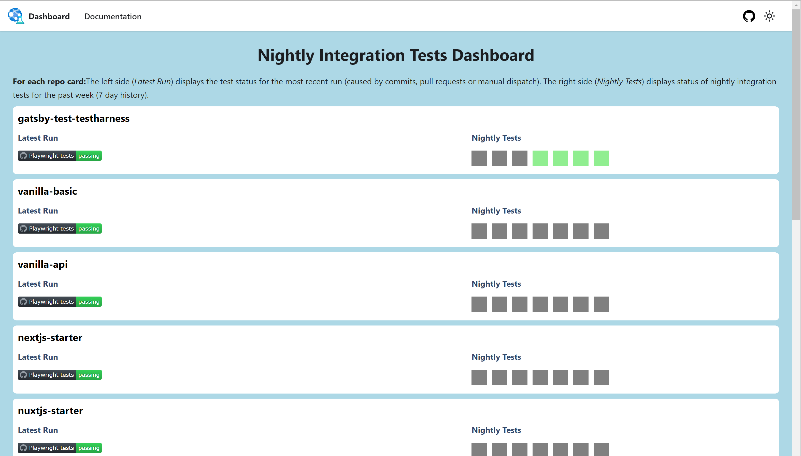

# Nightly Builds 2022 Summer Intern Project

[](https://github.com/mspnp/intern-js-pipeline/actions/workflows/github-pages.yml)

Documentation and the code samples that are apart of them play an important role in a developer's experience. Code samples are the starting point for many developers and it's critical that they work in order for developers to gain a deeper understanding of the documentation as well as the technology itself.

This project aims to improve the quality of our code samples by running automated nightly integration tests on each repository referenced in documentation and then consolidating and presenting test results of all repositories on a dashboard. The goal was to take a proactive approach to ensuring all code samples work without wasting time manually testing each one.

### Dashboard

You can view the live dashboard here [Nightly Integration Tests Dashboard](https://mspnp.github.io/intern-js-pipeline/)

Or you can watch the video [here](./static/media/demo.mp4)



### Host a Dashboard

To spin up a local copy of the dashboard Node.js version 16.14 or higher is required. Clone the repository and type the following commands:

```cmd
npm install
npm start
```

For more detailed instructions on how to set up the test harness and dashboard please see [Nightly Integration Tests Dashboard Documentation](https://mspnp.github.io/intern-js-pipeline/docs/intro)
