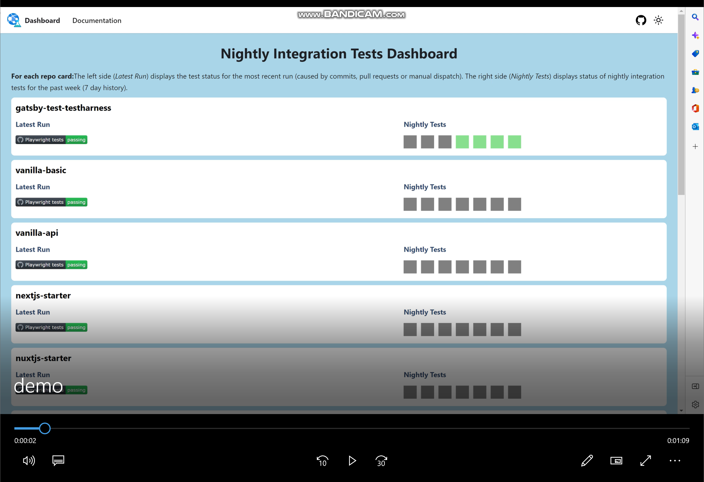
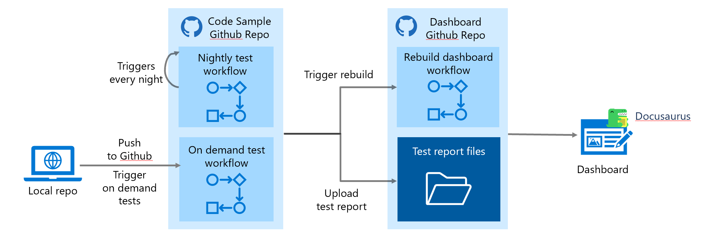

# Project Intro

Documentation and the code samples that are apart of them play an important role in a developer's experience. Code samples are the starting point for many developers and it's critical that they work in order for developers to gain a deeper understanding of the documentation as well as the technology itself.

## The Problem

With the thousands of code samples that are apart of our docs it's infeasible to manually ensure they all work. Code samples may break from modifications to the sample code, dependency updates, etc. We currently have a reactive solution, relying on our users to file Github issues in order to report that a code sample is broken. However, a portion of developers won't report the issue and instead choose to silently swap to another point of reference.

## Goals

This project aims to improve the quality of our code samples by running automated nightly integration tests on each repository referenced in documentation and then consolidating and presenting test results of all repositories on a dashboard. The goal was to take a proactive approach to ensuring all code samples work without wasting time manually testing each one.

## The Solution

The solution was to create a network of repositories each consisting of their own test harness and one overarching dashboard to report test results of each repository. As seen below, the dashboard consists of one pane per repository and each pane displays the results of latest test run on the left and a weekly summary of test reports on the right.

## Demo

## Behind the Scenes

The project consists of multiple repositories with test harnesses, Github workflows to run the tests nightly or after changes to the main branch, and a dashboard to display test results.

Every night the scheduled workflow triggers and when new changes are made to the main branch of each repository, the on demand workflow is triggered. These workflows run the repository's Playwright tests and upload the test reports to the `gh-pages` branch of the dashboard. The dashboard is then triggered to rebuild and show the latest test results.

## Try it Yourself

To set up this project on your own repositories, follow the step by step instructions provided in `Repository Integration`, `Dashboard Setup`, and `Setup Multiple Workflows for Different Testing Purposes`.
